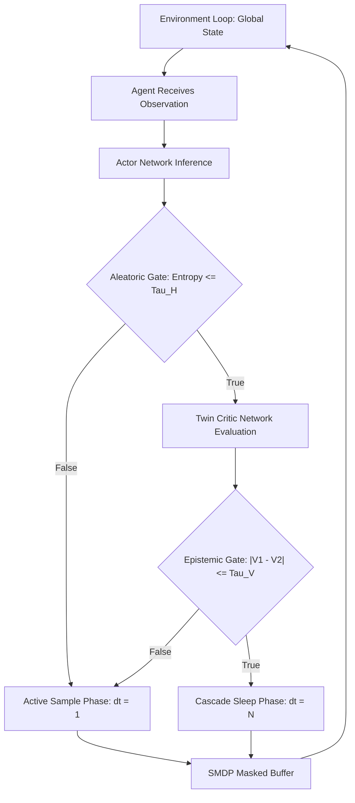
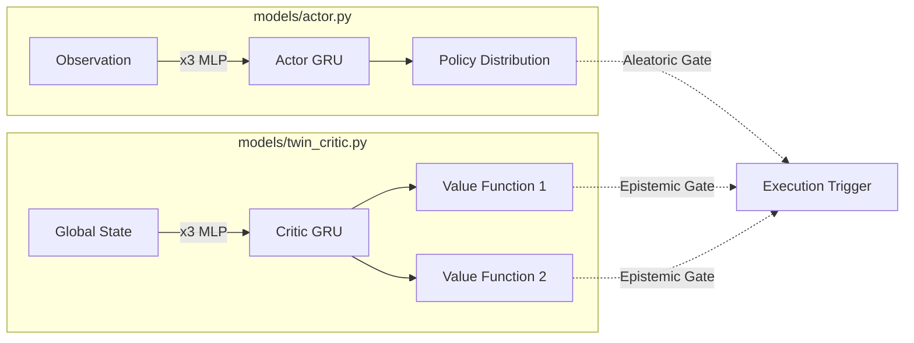

# Dual-Gated Epistemic Time-Dilation: Autonomous Compute Modulation in Asynchronous MARL

[](https://opensource.org/licenses/MIT)
[](https://zenodo.org/records/19206838)


This repository contains implementation of **Epistemic Time-Dilation MAPPO (ETD-MAPPO)**. As Multi-Agent Reinforcement Learning (MARL) algorithms achieve unprecedented successes across complex continuous domains, their standard deployment strictly adheres to a synchronous operational paradigm. ETD-MAPPO proposes a departure from synchronous determinism by allowing agents to autonomously modulate their own execution frequency.

## Key Contributions

* **Dual-Gated Epistemic Trigger**: Expands beyond primitive entropy tracking by utilizing deep Bayesian epistemic uncertainty extraction via Twin-Critic network variance. This correctly flags sparse-reward policy catastrophes, ensuring the architecture acts as a safety mechanism, maintaining full computation until the global state stabilizes.
* **SMDP-Aligned Asynchronous Gradient Masking Critic**: Introduces explicit masking logic over value trajectories alongside Lipschitz-bounded error corrections for multi-agent credit assignment.
* **Emergent Temporal Specialization**: Yields specific localized savings (up to 73.6% FLOP reduction for evasive roles) aligned with individual strategic burden.

## Algorithmic Logic Flow

Instead of rigid macro-actions, agents dynamically interpret their aleatoric uncertainty (evaluated via the Shannon entropy H of their categorical policy) and their epistemic uncertainty (measured through the state-value divergence in a Twin-Critic architecture).



## Architecture & Codebase Structure

The implementation is modularized into distinct components handling the neural topologies and the modified Proximal Policy Optimization logic. Extracting epistemic signals demands a rich, temporal embedding of the partially observable state space.

### 1. Neural Topologies (`/models`)

The Actor and Twin-Critics process vectorized observations utilizing isolated Multilayer Perceptrons mapping distinct Recurrent GRU cores.

* **Actor Network**: Comprises a 3-Layer MLP (64 units) feeding into a GRU (128 units), outputting the policy. The decentralized Actor networks rely natively on their localized aleatoric entropy to gate computation, requiring absolutely no continuous server communication.
* **Twin-Critic Network**: Comprises a 3-Layer MLP (64 units) feeding into a GRU (128 units). During initialization, the critics are instantiated using strict orthogonal weight initialization constraints. This guarantees mathematically distinct optimization trajectories. Both critics map the identical centralized state vector to an expected return.
* **Asynchronous Recurrent State Update**: To avoid corrupting the latent GRU representation of sleeping agents with redundant temporal cycles, we enforce a strict algorithmic masking procedure natively on the recurrent block. If an agent is dormant, it bypasses inference entirely and strictly preserves memory.



### 2. SMDP-Aligned PPO Algorithm (`/algorithms/ppo`)

Handling disparate temporal jumping requires rigid alignment of multi-agent credit assignment. Standard synchronized rollouts fail to assign localized credit accurately over variable intervals.

* **Semi-Markov Decision Process (SMDP) Formulation**: We formulate the environment as a Semi-Markov Decision Process (SMDP) and mitigate trajectory distortion via an SMDP-Aligned Generalized Advantage Estimation (GAE).
    * The temporally discounted effective reward accumulated during this sleep gap is calculated natively.
    * The SMDP-aligned Temporal Difference (TD) error jumps the entire gap natively, correctly anchoring against the next valid state.
    * The Generalized Advantage propagates backward through the gap by applying a recursive decay factor scaled explicitly by the sleep duration.
* **Asynchronous Gradient Masking**: During the Proximal Policy Optimization (PPO) parameter update cycle, evaluating states inside sleep blocks must be mathematically nullified. We implement Asynchronous Gradient Masking to force the contribution of dormant states to zero.
* **Lipschitz Error Bounding**: A strict Lipschitz bound theoretically justifies why the maximum sleep duration N must remain small and tightly regulated by the Epistemic Gate to prevent exponential error compounding during chaotic transitions.

## Empirical Results

ETD-MAPPO was rigorously evaluated across continuous simulators and grid environments using identical execution variants (Vanilla MAPPO and Fixed-Skip MAPPO):

* **Level-Based Foraging (LBF):** Epistemic Time-Dilation autonomously maintained alert execution trajectories computing exact instantaneous vectors mapping dense collisions appropriately, correctly achieving a peak 60.0% win completion threshold. In contrast, the rigid Fixed-Skip evaluation model collapsed natively down to exactly 20.0%.
* **Google Research Football (GRF):** By autonomously forcing execution during out-of-distribution state traversals, ETD-MAPPO securely stabilized the gradient updates, eventually recovering and sustaining a flawless 100.0% goal rate while still capturing a 5.2% localized FLOP reduction.
* **Multi-Particle Environment (MPE):** Generating long uniform tracking paths safely triggered deep state thresholds permitting evasive entities exclusively tracking massive efficiency yields achieving a robust 73.6% relative computational inference reduction.


## Citation

If you use this code in your research, please cite:

```bibtex
@misc{jankowski_2026_19206838,
  author       = {Jankowski, Igor},
  title        = {Dual-Gated Epistemic Time-Dilation: Autonomous
                   Compute Modulation in Asynchronous MARL
                  },
  month        = mar,
  year         = 2026,
  publisher    = {Zenodo},
  doi          = {10.5281/zenodo.19206838},
  url          = {https://doi.org/10.5281/zenodo.19206838},
}
```
